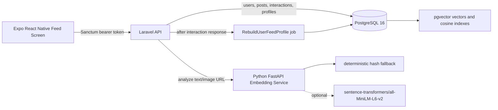
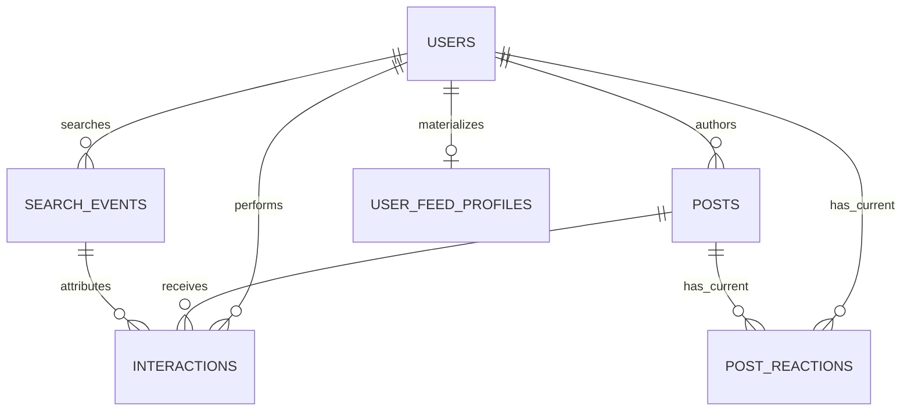

# Technical Solution Document

## 1. Document Status

This Technical Solution Document was prepared before application code and has been reconciled with the current implementation. The repository now contains the Laravel API, PostgreSQL/pgvector schema, Sanctum authentication, Python embedding/authenticity service, Expo React Native feed screen, SQL challenge answers, Docker Compose setup, seeders, and focused automated tests. Deployment, private GitHub publishing, final submission messaging, and the required explanation video remain outside the repository.

## 2. Problem Framing

Guised Up needs a Real Connections feed for authentic online expression: no curated highlight reels, no follower-count anxiety, and no ranking by global engagement. The feed should prioritize genuine content, real relationship depth, topic relevance, and freshness. Users can also search with natural language, for example `funny travel stories from last week`, and receive semantically relevant posts rather than keyword-only matches.

## 3. Requirement Source and Authority

The assessment PDF and `Assignment.md` define the submission requirements. This TSD is the technical solution document required by Part A. It explains the implemented approach, trade-offs, and limitations, and links to supporting detail in `docs/architecture.md`, `docs/testing.md`, `docs/features/`, and `docs/production-readiness.md`.

## 4. Implemented Scope

- Laravel API under `api/`.
- Python FastAPI embedding/authenticity service under `embedding-service/`.
- PostgreSQL 16 with pgvector through Docker Compose.
- Sanctum token authentication.
- Required endpoints: `POST /api/posts`, `GET /api/feed`, `GET /api/search`, and `POST /api/interactions`.
- Additional local/developer endpoints: `POST /api/tokens`, authenticated `GET /api/me`, and `DELETE /api/posts/{post}/reaction`.
- Expo React Native feed screen under `mobile/`.
- SQL answers in `sql/queries.sql`.
- Deterministic seed data and focused tests.

## 5. Intentionally Deferred Scope

- Public deployment.
- Private GitHub publishing and founder submission message.
- Explanation video.
- Full production upload pipeline for images and avatars.
- Broad natural-language temporal parsing beyond the implemented explicit `last week` rule.
- Verified production transformer-model deployment; Docker defaults to deterministic fallback.

## 6. Architecture



Main request flows:

- Post creation: mobile/API client sends text and optional image URL; Laravel validates; Laravel calls Python; Laravel validates a 384-dimensional vector; PostgreSQL stores the post, embedding, and authenticity scores.
- Feed: Laravel loads candidate posts, reads the stored feed profile or cold-start defaults, scores candidates, sorts deterministically, attaches development diagnostics only when enabled, and paginates 20 per page.
- Search: Laravel embeds the query, parses temporal intent, performs vector similarity, returns at most 10 posts, and records a search event only for successful non-empty searches.
- Interaction: Laravel records raw interaction history, updates current reaction state for reactions, and dispatches non-blocking profile rebuild work.

More detailed Mermaid diagrams are in `docs/architecture.md`.

## 7. Component Responsibilities

- React Native owns presentation, local feed/search state, bounded infinite scroll, reaction UI, qualified-view detection, and mobile configuration.
- Laravel owns authentication, validation, orchestration, ranking, pagination, persistence, API responses, search-event logging, and feed-profile materialization.
- Python owns text embedding generation and explainable authenticity heuristics.
- PostgreSQL and pgvector own relational and vector persistence.

## 8. Database Design

### `users`

Purpose: authenticated users and post authors.

Important columns: `id`, `name`, `email`, `avatar_url`, `password`, timestamps. `email` is unique. Deleting a user cascades through posts, interactions, current reactions, search events, and feed profiles.

### `personal_access_tokens`

Purpose: Laravel Sanctum bearer tokens.

Important columns: tokenable polymorphic keys, `name`, hashed `token`, `abilities`, `last_used_at`, `expires_at`, timestamps. Tokens are stored hashed, not as plaintext.

### `posts`

Purpose: user-created feed/search content.

Important columns: `id`, `user_id`, `text`, nullable `image_url`, `embedding vector(384)`, `text_authenticity_score`, nullable `image_authenticity_score`, `authenticity_score`, `embedding_status`, timestamps.

Keys and indexes: primary key `id`; foreign key `user_id -> users.id` with cascade delete; `posts(user_id, created_at)`; `posts(created_at)`; HNSW pgvector cosine index on `embedding`.

### `interactions`

Purpose: immutable raw behavioral evidence for views, replies, and reactions.

Important columns: `id`, `user_id`, `post_id`, `type`, nullable `reaction_kind`, `source`, nullable `search_event_id`, nullable `visible_duration_ms`, timestamps. `type` is constrained to `view`, `reply`, or `reaction`. `source` is constrained to `feed` or `search`.

Indexes: `interactions(user_id, created_at)`, `interactions(user_id, post_id, type)`, `interactions(post_id, type, created_at)`, `interactions(user_id, id)`, and `interactions(source, search_event_id)`.

Deletion: user/post deletion cascades through interaction rows. Search-event deletion nulls `search_event_id`.

### `post_reactions`

Purpose: current viewer reaction state separate from raw interaction history.

Important columns: `id`, `user_id`, `post_id`, `reaction_kind`, timestamps. A unique constraint on `(user_id, post_id)` ensures one active reaction per viewer/post. Current supported reaction kinds are `like`, `support`, and `good_vibes`. Deleting a row removes current state only; it does not delete historical interaction rows.

### `search_events`

Purpose: provenance for successful non-empty semantic searches.

Important columns: `id`, `user_id`, `query_text`, `semantic_query`, `query_embedding vector(384)`, `embedding_mode`, nullable `temporal_filter`, `result_post_ids`, timestamps.

Indexes: `search_events(user_id, created_at)`. Search events do not directly update ranking; they provide attribution for later qualified views or reactions from search results.

### `user_feed_profiles`

Purpose: materialized per-user ranking inputs so feed requests do not aggregate unbounded raw interactions.

Important columns: `user_id` unique foreign key, nullable `interest_embedding vector(384)`, `relationship_scores` JSON, `evidence_count`, nullable `source_interaction_id`, `computed_at`, timestamps.

The `source_interaction_id` watermark prevents older background rebuild snapshots from overwriting newer profile evidence.

### `cache` and `cache_locks`

Purpose: Laravel database cache/lock tables used by local cache clearing and overlap protection for feed-profile rebuild work. They are framework support tables, not product data.

## 9. Relationships



## 10. Embeddings and pgvector

The Python service is configured for `sentence-transformers/all-MiniLM-L6-v2`, which produces 384-dimensional embeddings. Docker defaults to deterministic fallback mode so the assessment can run without model downloads. The fallback uses stable SHA-256 hashing and returns exactly 384 finite numbers, but it is not genuine semantic understanding.

Post embeddings are generated during `POST /api/posts`. Query embeddings are generated during `GET /api/search`. Laravel validates every external embedding response before persistence or similarity use. PostgreSQL stores vectors in `vector(384)` columns and uses cosine distance through pgvector; `posts.embedding` has an HNSW cosine index.

Production swap path: install `embedding-service/requirements-optional-transformer.txt`, set `EMBEDDING_MODE=transformer`, confirm model download/resource availability, and keep Laravel behind the same `EmbeddingClient` boundary.

Failure behavior: malformed or unavailable embedding responses return service errors and do not create partial posts. Search embedding failure returns an error rather than silently falling back to keyword search.

## 11. API Design

### `POST /api/tokens`

Authentication: public local development helper.

Request: `email`, `password`, optional `device_name`.

Success: returns a Sanctum bearer token. Tokens must not be committed or printed in documentation.

Errors: `422` invalid input or credentials.

### `GET /api/me`

Authentication: Sanctum required.

Success shape:

```json
{
  "id": 1,
  "name": "Alex Rivera",
  "email": "alex@example.test",
  "avatar_url": "https://example.com/avatar.jpg"
}
```

### `POST /api/posts`

Authentication: Sanctum required.

Request: `text` required string; `image_url` optional nullable URL.

Success: `201` with `data.id`, `data.author`, `data.text`, `data.image_url`, authenticity scores, `embedding_status`, `viewer_has_reacted`, `viewer_reaction_kind`, and timestamps.

Side effects: creates a post, calls the embedding service, stores a 384-dimensional vector and authenticity data. No partial post is persisted on embedding failure.

### `GET /api/feed`

Authentication: Sanctum required.

Request: optional `page`.

Success: `200` with `data`, `links`, and `meta`; returns 20 posts per page when available. Each post includes author information, post text, image URL, created time, reaction state, and optional development-only `ranking_debug`.

Errors: `401` unauthenticated, `422` invalid page.

Side effects: read-only for the response. If the feed profile is missing or stale, a rebuild is dispatched after the response path without blocking the feed.

### `GET /api/search?q={query}`

Authentication: Sanctum required.

Validation: `q` is required and non-empty after trimming.

Success: `200` with at most 10 posts and `meta`, including `search_event_id` for successful non-empty searches, `embedding_mode`, and parsed temporal filter metadata. Results include `similarity_score`; they do not include feed ranking diagnostics.

Side effects: records a `search_events` row only for successful non-empty searches. Blank searches, validation failures, and embedding failures are not logged.

### `POST /api/interactions`

Authentication: Sanctum required.

Request:

```json
{
  "post_id": 123,
  "type": "reaction",
  "reaction_kind": "like",
  "source": "feed",
  "search_event_id": null,
  "visible_duration_ms": null
}
```

Validation:

- `post_id` must exist.
- `type` must be `view`, `reply`, or `reaction`.
- `reaction_kind` is allowed for reactions and defaults to `like` for older clients.
- `source` defaults to `feed`; `search_event_id` is allowed only with `source=search`.
- Search-attributed interactions must reference a search event owned by the authenticated user and a post returned by that event.
- `visible_duration_ms` is allowed only for `view`.

Side effects: creates a raw interaction. Reactions also activate or switch current `post_reactions` state and dispatch non-blocking feed-profile rebuild work.

### `DELETE /api/posts/{post}/reaction`

Authentication: Sanctum required.

Success: `200` with current reaction state cleared for the authenticated viewer. Idempotent; raw interaction history is preserved.

## 12. Feed Ranking

Plain English: each candidate post is scored by how authentic it appears, how strong the authenticated viewer's relationship is with the author, how semantically close the post is to the viewer's materialized interest profile, and how recent it is. No global popularity counts are used.

Formula:

```text
final_score =
    0.30 × authenticity
  + 0.30 × relationship_depth
  + 0.25 × semantic_similarity
  + 0.15 × time_decay
```

Pseudocode:

```text
profile = load user_feed_profiles row or cold-start defaults
if profile is missing or stale:
  dispatch RebuildUserFeedProfile after response

candidates = load bounded post candidate set
for each candidate:
  authenticity = clamp(post.authenticity_score)
  relationship = profile.relationship_scores[post.user_id] or 0
  semantic = cosine(profile.interest_embedding, post.embedding) normalized to 0..1
             or cold_start_semantic_similarity
  time = exp(-ln(2) * age_seconds / time_decay_half_life_seconds)
  final = weighted sum using configured weights

sort by final DESC, created_at DESC, id DESC
if debug is enabled outside production:
  attach rank and component contributions after full sorting
paginate 20 per page
```

Signal details:

- Authenticity: stored `authenticity_score` generated by explainable text heuristics and nullable image authenticity when real image analysis exists. The current implementation does not infer authenticity from image URL presence.
- Relationship: materialized from the authenticated viewer's own raw interactions with each author. Replies weigh more than reactions; reactions weigh more than views. Events use a 30-day half-life decay. Search/feed provenance is preserved, but global totals are not used as popularity.
- Semantic similarity: a materialized interest vector is computed from posts the viewer interacted with. Cosine similarity is normalized to `0..1`. Cold-start users use the configured neutral semantic value.
- Time relevance: exponential decay with a 7-day half-life.

Sorting is deterministic: `final_score DESC`, `created_at DESC`, `id DESC`. Rank debug position is calculated against the full ranked candidate collection before pagination. The mobile debug card displays full labels: Authenticity, Relationship, Semantic similarity, and Time relevance.

## 13. Profile Materialization

`GET /api/feed` does not aggregate raw interaction history. It uses the stored profile immediately when present and dispatches a background/deferred rebuild when missing or stale. Interaction writes dispatch `RebuildUserFeedProfile` after successful persistence. The rebuild stores interest embedding, relationship scores, evidence count, and a source interaction watermark. Older snapshots cannot overwrite newer watermarks.

If the framework/environment has no persistent queue worker, the configured `deferred` connection keeps rebuild work outside the immediate feed request path for local assessment use.

## 14. Search

Search embeds the natural-language query through the same embedding-service boundary, parses a small temporal intent set, and performs vector similarity rather than SQL keyword matching. Results are capped at 10. The explicit `last week` rule removes the phrase from the semantic query and applies a trailing seven-day `created_at` filter. `funny travel stories from last week` therefore searches the semantic topic `funny travel stories` within the last seven days.

Search events store query text, semantic query, query embedding, embedding mode, temporal filter, and result ids. A search alone is exploratory evidence and does not update feed ranking.

## 15. Interaction Logging and Qualified Views

Raw interactions preserve `view`, `reply`, and `reaction` history for relationship ranking and SQL reporting. Current reaction state is stored separately in `post_reactions`.

The mobile app uses FlatList viewability with 50% visibility and 1500 ms minimum view time. Qualified views are sent asynchronously with `source`, optional `search_event_id`, and `visible_duration_ms`; write failures do not block scrolling or rendering. Session deduplication prevents repeated view writes for the same source/search-event/post combination.

## 16. Authentication and Security

Sanctum bearer tokens protect all assignment endpoints. Passwords are hashed by Laravel. Secrets and tokens belong only in ignored `.env` files. CORS is configured for local assessment origins. Production hardening should add rate limiting, token rotation policies, stronger CORS/domain configuration, HTTPS-only transport, request logging redaction, and abuse controls for interaction spam.

## 17. Testing and Verification

Automated coverage includes:

- Laravel feature tests for authentication, post creation, feed ranking, search, interactions, typed reactions, ranking diagnostics, search-event provenance, and profile rebuild behavior.
- Python tests for health, embedding shape, 384 dimensions, deterministic fallback repeatability, finite output, fallback labeling, authenticity bounds, nullable image authenticity, and invalid input.
- Mobile TypeScript tests for API error mapping, pagination, search-state races, bounded page retention, reactions, qualified-view keys, ranking-debug display, and reaction-control behavior.
- SQL queries verified against PostgreSQL-compatible schema and representative fixtures during prior audit passes.

Most recent clean-checkout verification recorded 43 Laravel tests with 1 skipped and 151 assertions, 9 Python tests, 30 mobile tests, successful mobile TypeScript type-checking, and Expo Doctor 18/18. Those totals reflect the latest documented verification pass and should be updated only after rerunning the suites.

## 18. AI-Agentic Tools Used

Codex was used for requirement traceability, governance docs, architecture/TSD drafting, feature specification, implementation, test creation, debugging, documentation synchronization, and final verification. Generated changes were reviewed against the assignment, code contracts, tests, migrations, API smoke checks, and Docker verification. AI output was not treated as sufficient evidence without command results or file inspection.

## 19. Trade-Offs and Assumptions

- pgvector keeps relational and vector data together and is faster to ship than a managed vector system, but a larger production system might move to a dedicated vector store.
- Synchronous post embedding simplifies consistency; failures prevent partial post creation.
- Deterministic fallback enables reproducible tests and no-credit local runs but is not true semantic retrieval.
- The temporal parser is intentionally small.
- Raw events are preserved while materialized profiles keep feed requests bounded.
- Offset/page pagination is simple and mobile-compatible, but cursor pagination or ranking snapshots would be more stable in production.
- The mobile feed caps retained pages in memory rather than storing an offline feed cache.
- Demo media uses HTTPS URL references; production should use object storage/CDN and metadata rather than database blobs.

## 20. Operational Behavior

Local startup uses Docker Compose. Migrations create the PostgreSQL schema from an empty database and enable pgvector. Seeders are deterministic and idempotent for project-owned fixtures. The embedding service health endpoint is `/health`; Laravel health is `/up`. Queue/profile rebuild behavior is configured through `FEED_PROFILE_REBUILD_CONNECTION` and `QUEUE_CONNECTION`.

Observability is intentionally lightweight for the assessment. Logs must not include bearer tokens, passwords, headers, or local environment contents.

## 21. Known Limitations

- Explanation video and final submission message are not present.
- Deployment is not completed.
- Physical-device acceptance remains a manual owner step.
- Transformer model execution is optional and not claimed unless dependencies and model download are run successfully.
- Semantic temporal parsing is limited.
- Feed profiles are eventually consistent.
- Reaction writes do not yet have offline retry/idempotency-key handling.
- External demo media can fail independently of the app.

## 22. Traceability

- Part A: this TSD plus `docs/architecture.md`, `docs/ai-usage.md`, and feature documents.
- Part B: `api/`, `embedding-service/`, Docker Compose, migrations, seeders, and backend/Python tests.
- Part C: `mobile/` app, API client, hooks/reducer, components, theme, and mobile tests.
- Part D: `sql/queries.sql`.
- Submission: README, environment examples, TSD, SQL file, AI-usage docs, and known limitations are present; video, deployment, private repo push, and final message remain manual.
