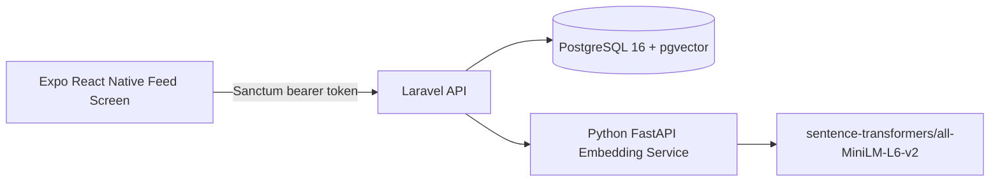

# Technical Solution Document

## 1. Document Status

This Technical Solution Document was prepared before application code. It has now been reconciled with the backend foundation, feed implementation, semantic-search implementation, SQL challenge implementation, Expo React Native Feed Screen implementation, and final integration audit fixes. Laravel post, feed, search, and interaction endpoints, PostgreSQL/pgvector migrations, Sanctum token authentication, Docker Compose configuration, Python embedding/authenticity service, README, `.env.example`, SQL challenge answers, one Expo mobile feed screen, and focused tests exist. Deployment, private GitHub publishing, final submission messaging, and video remain deferred.

## 2. Requirement Sources and Authority

`Assignment.md` is the immutable, complete, highest-authority assessment transcription for this repository. This TSD implements the approved documentation scope only and does not modify the assessment contract.

## 3. Requirements Traceability

- Part A maps to US-01 through US-08 and US-35.
- Part B maps to US-09 through US-23.
- Part C maps to US-24 through US-30.
- Part D maps to US-31 through US-34.
- Submission and evidence work maps to US-35 through US-39.

## 4. Product Objective

Guised Up needs a Real Connections Feed that ranks posts by authenticity signals, relationship depth, semantic similarity, and time decay. Global engagement metrics do not rank content. Natural-language search must retrieve semantically related posts rather than matching keywords.

## 5. Scope

The intended implementation is a monorepo containing an Expo React Native TypeScript mobile screen, Laravel API, Python embedding service, PostgreSQL 16 with pgvector, raw SQL challenge answers, documentation, and reproducible local setup.

## 6. Explicit Non-Goals

- Ranking by likes, shares, comments, follower totals, global views, global replies, or global reactions.
- Keyword-only search as a substitute for semantic search.
- Inferring image polish or authenticity from the mere presence of an image URL.
- Treating deterministic hash embeddings as genuine semantic search.
- Claiming runtime behavior before implementation and verification.

## 7. System Architecture

The proposed system uses Expo React Native for the feed UI, Laravel as the authoritative API, PostgreSQL plus pgvector for relational and vector persistence, and a small Python FastAPI service for embeddings and explainable authenticity analysis.



More detailed Mermaid sources are in `docs/architecture.md`.

## 8. Component Responsibilities

- React Native owns presentation, mobile interaction state, infinite scrolling, search input, inline results, and reaction affordances.
- Laravel owns authentication, validation, orchestration, ranking, pagination, persistence, and API responses.
- Python owns embedding generation and explainable authenticity analysis.
- PostgreSQL and pgvector own relational and vector persistence.

## 9. Database Schema

The implemented schema uses these tables: `users`, `personal_access_tokens`, `posts`, `interactions`, and `post_reactions`.

`users`: Laravel user table with `id` primary key, `name`, unique `email`, optional `avatar_url`, password fields, timestamps, and any standard authentication fields required by Laravel.

`personal_access_tokens`: Laravel Sanctum token table with tokenable relationship, token name, hashed token, abilities, last-used timestamp, optional expiration, and timestamps.

`posts`:

| Field | Type | Nullability | Notes |
|---|---|---|---|
| `id` | bigserial / bigint | not null | Primary key |
| `user_id` | bigint | not null | Foreign key to `users.id` |
| `text` | text | not null | Post body |
| `image_url` | varchar / text | nullable | Optional image URL |
| `embedding` | vector(384) | not null when embedding succeeds | pgvector embedding |
| `text_authenticity_score` | decimal | not null | Normalized 0..1 |
| `image_authenticity_score` | decimal | nullable | Nullable without real image-analysis signal |
| `authenticity_score` | decimal | not null | Normalized 0..1 aggregate |
| `embedding_status` | varchar | not null | `ready`, `fallback`, or `failed` |
| `created_at` | timestamp | not null | Creation time |
| `updated_at` | timestamp | not null | Last update time |

`interactions`:

| Field | Type | Nullability | Notes |
|---|---|---|---|
| `id` | bigserial / bigint | not null | Primary key |
| `user_id` | bigint | not null | Foreign key to `users.id` |
| `post_id` | bigint | not null | Foreign key to `posts.id` |
| `type` | enum / constrained varchar | not null | `view`, `reply`, or `reaction` |
| `reaction_kind` | varchar | nullable | `like`, `support`, or `good_vibes` when `type = reaction`; older generic reaction rows may remain null |
| `created_at` | timestamp | not null | Event time |
| `updated_at` | timestamp | not null | Last update time |

`post_reactions`: current viewer reaction state, separate from raw interaction history, with `id`, `user_id`, `post_id`, `reaction_kind`, and timestamps. A unique index on `(user_id, post_id)` makes current reaction state idempotent while preserving repeated raw `interactions` rows for ranking and SQL reporting. The active reaction catalog is currently `like`, `support`, and `good_vibes`.

Deletion behavior: deleting a user should delete that user's posts, interactions, current reactions, and Sanctum tokens. Deleting a post should delete its interactions and current reactions. The implementation must avoid orphaned relationship-depth events.

## 10. Relationships and Indexes

Relationships:

- `users` has many `posts`.
- `users` has many `interactions`.
- `posts` belongs to `users`.
- `posts` has many `interactions`.
- `posts` has many `post_reactions`.
- `interactions` belongs to `users`.
- `interactions` belongs to `posts`.
- `post_reactions` belongs to `users`.
- `post_reactions` belongs to `posts`.

Required indexes:

- `posts(user_id, created_at)`
- `posts(created_at)`
- `interactions(user_id, created_at)`
- `interactions(user_id, post_id, type)`
- `interactions(post_id, type, created_at)`
- pgvector cosine index on `posts.embedding`

SQL challenge support:

- D1 uses `interactions(user_id, created_at)` and interaction `type`.
- D2 uses `interactions(user_id, post_id, type)`, joins to `posts`, and filters `posts.created_at`.
- D3 uses `interactions(post_id, type, created_at)` to count views and reactions per post.
- D4 uses `posts(user_id, created_at)` and joins to `users` for email.

## 11. Embedding Generation and Storage

Post creation sends post text to the Python FastAPI service through a Laravel `EmbeddingClient` boundary. The service is configured for `sentence-transformers/all-MiniLM-L6-v2`, with deterministic fallback as the default Docker/test mode to avoid mandatory model downloads. Laravel validates exactly 384 finite embedding values, stores them in `posts.embedding` as `vector(384)` under PostgreSQL, and records `embedding_status`.

## 12. pgvector Selection and Rationale

pgvector is selected because it satisfies the permitted vector database requirement while keeping relational and vector data in PostgreSQL. It fits the eight-hour assessment by reducing infrastructure overhead, keeping migrations reproducible, and supporting cosine similarity indexes close to the posts and interactions data.

## 13. Embedding Lifecycle and Failure Behavior

For `POST /api/posts`, Laravel validates input, requests embedding and authenticity analysis, then persists the post inside a transaction. If fallback mode is used, the stored post is marked `embedding_status = fallback`. If the embedding service fails or returns malformed data, Laravel returns a service error and does not persist a partial post.

## 14. Deterministic Fallback Strategy and Limitations

The deterministic hash embedding maps normalized text tokens into a stable 384-dimensional vector. It is useful for tests and unavailable model downloads. The hash embedding is deterministic test/failure infrastructure, not genuine semantic search, and must be labeled wherever it affects behavior.

## 15. Sanctum Authentication Strategy

Laravel Sanctum token authentication protects the implemented `POST /api/posts`, `GET /api/feed`, `GET /api/search`, and `POST /api/interactions` endpoints. A local token helper, `POST /api/tokens`, issues tokens for seeded users. Requests without a valid bearer token receive `401`.

## 16. API Contracts

### `POST /api/posts`

Authentication: Sanctum bearer token required.

Request:

```json
{
  "text": "A real post body",
  "image_url": "https://example.com/image.jpg"
}
```

Validation: `text` is required, string, trimmed, and length-limited. `image_url` is optional, nullable, and must be a valid URL when present.

Success: `201 Created` with post id, author summary, text, image URL, authenticity scores, embedding status, and timestamps.

Errors: `401` unauthenticated, `422` validation error, `503` embedding service unavailable when no fallback is allowed.

Data impact: creates one `posts` row, generates and stores an embedding automatically, and stores explainable authenticity fields.

### `GET /api/feed`

Authentication: Sanctum bearer token required.

Request query: optional `page` parameter.

Success: `200 OK` with ranked posts and pagination metadata or links. Feed returns 20 results per page when a full page is available.

Each result includes `viewer_has_reacted`, `viewer_reaction_kind`, and author `avatar_url` scoped to the authenticated viewer when available.

Errors: `401` unauthenticated, `422` invalid pagination input.

Data impact: read-only.

### `GET /api/search?q={query}`

Authentication: Sanctum bearer token required.

Validation: `q` is required, string, trimmed, and non-empty.

Success: `200 OK` with at most 10 semantically relevant posts, author information, post text, optional image URL, creation time, similarity score, embedding mode, and metadata describing any temporal filter.

Each result includes `viewer_has_reacted`, `viewer_reaction_kind`, and author `avatar_url` scoped to the authenticated viewer when available.

Errors: `401` unauthenticated, `422` empty query, `503` embedding service unavailable when no fallback is allowed.

Behavior: search performs vector similarity, not SQL keyword matching. The implementation converts the `last week` temporal phrase to a trailing seven-day `created_at` filter in addition to semantic similarity. For `funny travel stories from last week`, the query embedding represents the semantic portion after removing `last week`, and the date filter restricts results to the trailing seven days.

Data impact: read-only.

### `POST /api/interactions`

Authentication: Sanctum bearer token required.

Request:

```json
{
  "post_id": 123,
  "type": "reaction",
  "reaction_kind": "like"
}
```

Validation: `post_id` must identify an existing post. `type` accepts only `view`, `reply`, or `reaction`. When `type = reaction`, `reaction_kind` accepts `like`, `support`, or `good_vibes`; older clients that omit `reaction_kind` default to `like`.

Success: `201 Created` with interaction id, post id, type, and timestamp.

Errors: `401` unauthenticated and `422` validation errors for invalid type or missing/nonexistent post.

Data impact: persists a raw interaction event for relationship-depth ranking and SQL reporting.

For `type = reaction`, the same request also records raw event history and activates or switches the authenticated user's current reaction state for that post.

### `DELETE /api/posts/{post}/reaction`

Authentication: Sanctum bearer token required.

Success: `200 OK` with post id, `viewer_has_reacted: false`, and `viewer_reaction_kind: null`.

Data impact: removes only the authenticated user's current reaction state. It does not delete raw `interactions` rows and is idempotent.

## 17. Feed-Ranking Logic in Plain English

The feed scores candidate posts for the authenticated user. It rewards posts that appear authentic, come from authors the user has personally interacted with, semantically match the user's recent interests, and are reasonably fresh. Global engagement or popularity must never affect ranking. Global views, reactions, replies, comments, likes, shares, or follower totals must not contribute to `final_score`.

## 18. Feed-Ranking Pseudocode

```text
for each candidate post:
  authenticity = normalized post.authenticity_score
  relationship_depth = score current user's decayed interactions with post.author
  semantic_similarity = cosine_similarity(user_interest_vector, post.embedding)
  time_decay = exp(-age_seconds / half_life_seconds)

  final_score =
      0.30 × authenticity
    + 0.30 × relationship_depth
    + 0.25 × semantic_similarity
    + 0.15 × time_decay

order by final_score desc, created_at desc, id desc
paginate 20 per page
```

## 19. Signal Normalization

All component scores are normalized to `0..1`.

Authenticity uses documented, explainable text signals and nullable image signals when genuine image analysis exists. Relationship depth uses only the authenticated user's interactions with each author. Replies weigh more than reactions, and reactions weigh more than views. Relationship events use recency decay. Semantic similarity uses cosine similarity against an interest vector derived from posts the authenticated user interacted with. Time decay uses an exponential half-life.

## 20. Cold-Start Behavior

If the authenticated user has too few interactions to form a reliable interest vector, semantic similarity should fall back to a neutral value or a profile-independent recent-authentic blend. The system should still avoid global popularity signals. New users should receive recent, authentic posts with stable ordering.

## 21. Stable Ordering and Pagination

Stable ordering is:

1. `final_score DESC`
2. `created_at DESC`
3. `id DESC`

`GET /api/feed` returns 20 posts per page when a full page is available and exposes pagination metadata or links.

## 22. Natural-Language Semantic Search

Search embeds the user's query and compares it to post embeddings using cosine similarity. It must not degrade silently into keyword search. If deterministic fallback embeddings are active, results must be understood as deterministic approximation rather than genuine semantic retrieval.

## 23. Temporal-Intent Handling

Temporal phrases are parsed into explicit date filters in addition to semantic similarity. The implemented `last week` rule uses a trailing seven-day `created_at` range. For `funny travel stories from last week`, the system embeds the semantic topic after removing `last week` and applies that trailing seven-day filter.

## 24. Interaction Logging

Interactions are raw events with type `view`, `reply`, or `reaction`. They support relationship-depth ranking and SQL reporting. Raw global totals from these events must not become global engagement ranking inputs.

## 25. Testing Strategy

Focused backend tests now cover Sanctum-protected post creation, feed retrieval, semantic search, and interaction logging; validation; persistence; malformed embedding responses; embedding-service failure behavior; repeated raw interactions; deterministic fallback; embedding dimensions; mocked transformer shape; authenticity score bounds; nullable image authenticity; health; invalid input; all four feed-ranking signals; stable ordering; 20-per-page feed pagination; search ranking order; search result limit; empty search results; and `last week` temporal filtering. SQL challenge queries were verified against PostgreSQL with rolled-back fixtures and `EXPLAIN`. The final integration audit also passed authenticated HTTP smoke testing against Docker PostgreSQL for token issuance, post creation, embedding persistence, interaction creation, feed, search, validation, and cleanup of marked smoke data. The Expo mobile feed screen has passed TypeScript checking, 7 reducer/state tests, and local Expo Metro startup; Expo Web and simulator/device rendering remain unverified. Deployment and video tests remain deferred.

## 26. Security and Privacy

The project is confidential and must not be shared. Secrets belong in local `.env` files and must not be committed. `.env.example` will document required keys without real credentials. Sanctum tokens must be hashed and revocable.

## 27. Observability and Failure Handling

The implementation should log embedding service failures, fallback activation, invalid input, and ranking execution errors without leaking secrets. User-facing errors should distinguish validation, authentication, and temporary service failures.

## 28. AI-Agentic Tools Actually Used

Codex has been used for requirements traceability, repository governance preparation, architecture documentation, TSD drafting, feature-specification drafting, documentation consistency review, roadmap evidence synchronization, Laravel foundation implementation, PostgreSQL/pgvector schema implementation, Python embedding-service implementation, post/feed/search/interaction endpoint implementation, SQL challenge implementation, Expo React Native Feed Screen implementation, final integration audit fixes, automated-test creation, and documentation synchronization. No deployment, hosted repository configuration, final submission, or video generation has been performed.

## 29. Trade-Offs

- pgvector reduces infrastructure complexity but is less specialized than a managed vector service.
- A local sentence-transformers model avoids API credits but adds model download and Python runtime concerns.
- Deterministic fallback improves tests and offline resilience but does not provide true semantic understanding.
- A fixed weighted ranking formula is explainable and fast to implement but less adaptive than learned ranking.
- Nullable image-authenticity scoring avoids fake precision until genuine image analysis exists.

## 30. Assumptions

- PostgreSQL is acceptable because `Assignment.md` permits MySQL or PostgreSQL.
- pgvector satisfies the allowed vector database requirement.
- Laravel Sanctum bearer tokens are sufficient for the assessment API.
- The React Native deliverable can be a single Expo screen integrated with the documented API.
- The implementation can use Markdown TSD at `/docs/TSD.md`.

## 31. Known Limitations

- The transformer model path is configured, but the real model dependency and model download are optional and not runtime-verified.
- Semantic search uses vector similarity and supports the documented `last week` filter, but broader temporal parsing remains intentionally limited.
- Docker clean-start was partially verified through image builds, Laravel tests, Python tests, and PostgreSQL migrations; full reviewer-machine reproducibility still requires an external clean checkout/run.
- A rolled-back PostgreSQL verification executed the pgvector cosine-distance operator against `posts.embedding`; final authenticated HTTP smoke testing also exercised `GET /api/search` against the Docker PostgreSQL stack.
- SQL challenge queries were executed with rolled-back PostgreSQL fixtures and explained with `EXPLAIN`; no performance benchmark was performed.
- The Expo mobile app reached Metro startup and passed static/state checks, but Expo Web dependencies are not installed and simulator/device rendering was not verified.

## 32. Traceability to US-00 through US-08

- US-00: Guardrails documented in `AGENTS.md`, `docs/governance.md`, and this TSD; execution remains ongoing.
- US-01: Product objective and non-engagement ranking are documented.
- US-02: System architecture is documented here and in `docs/architecture.md`.
- US-03: Schema, relationships, and indexes are documented.
- US-04: Embeddings, pgvector, and fallback are documented.
- US-05: API contracts and Sanctum authentication are documented.
- US-06: Ranking logic, pseudocode, weights, normalization, and exclusions are documented.
- US-07: AI-agentic tool usage is documented here and in `docs/ai-usage.md`.
- US-08: Trade-offs, assumptions, fallback limits, and TSD placement are documented.

## 33. Deferred Implementation

Deferred work includes full clean-start verification from a fresh checkout, private repository publishing, final submission messaging, and explanation video.
