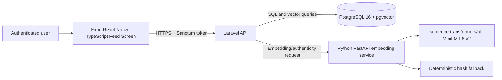
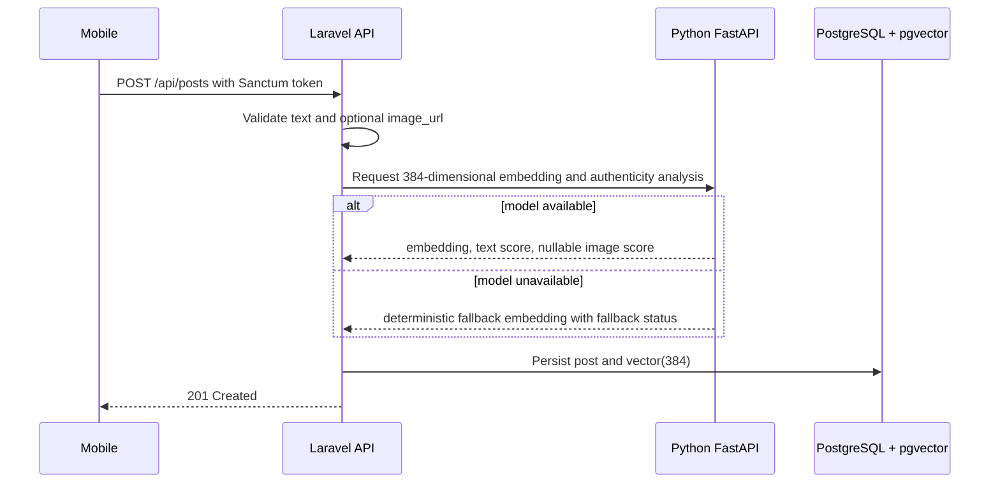
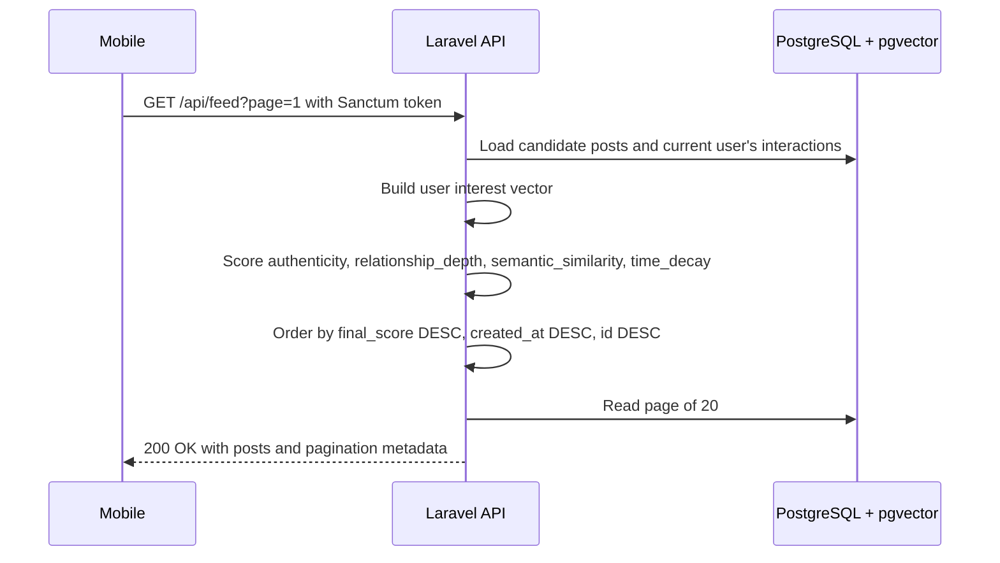
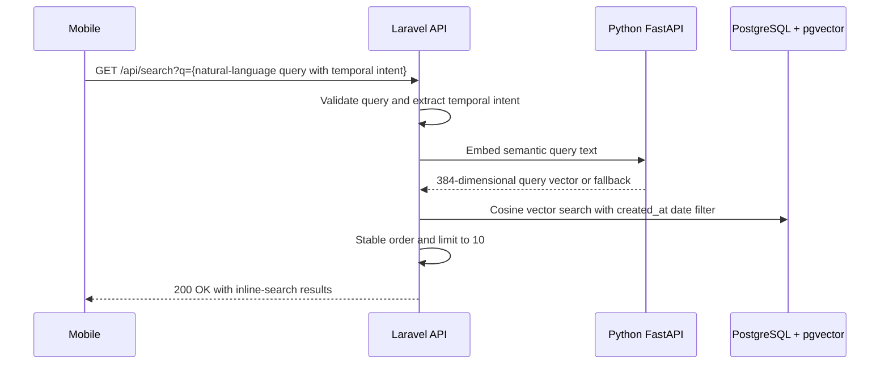
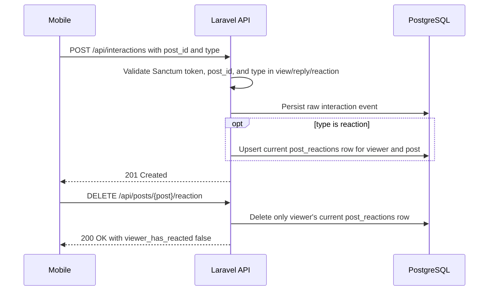
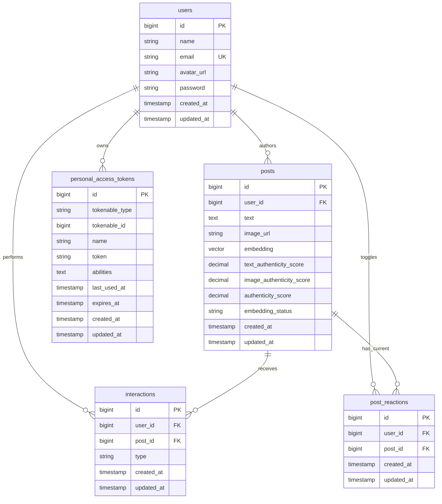

# Architecture Diagrams

These Mermaid diagrams are source diagrams only. No rendered PNG, SVG, PDF, or external diagram artifact has been generated.

## System Component Architecture

## Post-Creation and Embedding Flow

## Personalized-Feed Flow

## Semantic-Search and Temporal-Filter Flow

## Interaction-Logging Flow

## Entity-Relationship Diagram

